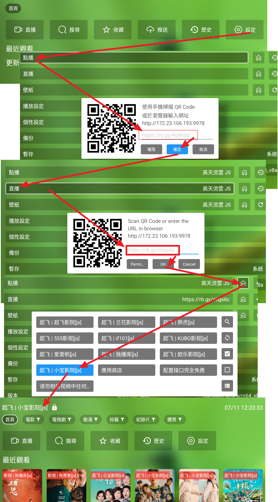

# 這裏所有資料與碼僅供研究，測試，與學習． 請勿用於非法用途，否則後果自負!!!

---------------------------------------------------------------------------------------------------------------------------------------------------------
 



# 蜂蜜 & TVBoxOSC

## 兩大系統："FongMi 蜂蜜與唐三維護: 影視ＴＶ, 蜂蜜影視"　與　"TVBoxOSC"　基礎概念
1. 接口　（源）－＞線路－＞站源　（一個接口可以包含很多線路，一個線路可以包含很多站源）
   1. 搜尋時，可以會自動搜尋同一個線路的所有站源的片
   2. 片上長按，可以搜尋所有站源的片
   3. ＂蜂蜜＂影視ＴＶ系列的下游播放器，　如: 寶盒，西夏，開心，天微，木魚，猫TV，春盈天下，三林，欧歌，星辰...
   4. 每條線路有自己的歷史記錄
2. 推薦：　蜂蜜影視ＴＶ　與　ＯＫＴＶ．　同Fongmi蜂蜜系列，支援注音輸入，直播多線路選擇，有英文，繁中，簡中選項，支援直播多線、自動換源、直播倍速，Ai去廣告等功能，手機投影螢幕等　
   1. 蜂蜜影視ＴＶ 唐三 https://xhdwc.tk/ or https://github.com/FongMi/Release or https://github.com/FongMi/TV or https://github.com/FongMi/Release/tree/fongmi/apk
   2. ＯＫＴＶ https://github.com/FongMi/Release/tree/main/apk
3. 常見版本：　https://github.com/dlgt7/TVbox-interface/blob/main/tvbox%E5%B8%B8%E8%A7%81%E7%89%88%E6%9C%AC.md
4. https://www.wmdz.com/tvboxFM.html (List of many apps)


## 安裝方式：
1. 電視上先裝 downloader. https://www.aftvnews.com/downloader/
2. 然後使用短碼383716，裝emotn商店 
3. 啟動 emotn輸入分享碼 emotn 分享碼796233 
4. 安裝 OK影視 或 影視TV


## 點播接口：
1. Rob Yang 點直播線源: http://RobYang.ggff.net 或 http://RobYang.rr.nu 或 https://RobYang.serv00.net
3. 寶盒=欧乐,泥巴　https://raw.githubusercontent.com/guot55/yg/main/pg/jsm.json
4. 泥巴,独播库,小宝,欧乐,腐剧　https://raw.githubusercontent.com/qist/tvbox/master/jsm.json (https://github.com/qist/tvbox)
5. https://raw.githubusercontent.com/gaotianliuyun/gao/master/js.json （https://github.com/gaotianliuyun/gao/tree/master） 
7. http://home.jundie.top:81/top98.json
8. https://raw.githubusercontent.com/jake3737/tvbox/master/js.json 
9. 教學 https://gitlab.com/xmbjm/omg/-/raw/main/omg.json
10. 欧乐,泥巴 (online js) https://gitlab.com/-/snippets/2343779/raw/main/snippetfile1.txt


## 直播接口： 
1. Rob Yang 點直播線源: http://RobYang.ggff.net 或 http://RobYang.rr.nu 或 http://RobYang.runasp.net 或 https://RobYang.serv00.net
5. https://www.juwanhezi.com/more/live 


## 多接口List：
1. https://raw.githubusercontent.com/cyalias/mytvs-github/refs/heads/main/myjk.json
2. https://tvbox.youdu.fan
3. https://www.upx8.com/4021
4. https://xn--qoqw77q.top/dcjk.html
5. http://www.52sw.top:678/play/oj1381/index.php?get=159169
6. https://tianyastudio.blogspot.com/search/label/TV 
7. https://github.com/li5bo5/TVBox?tab=readme-ov-file
8. International: https://iptv-org.github.io/iptv/index.m3u (https://github.com/iptv-org/iptv)

## 特別解析json:
1. https://github.com/wnddwc/daiweichun


## PG包　（本地包）：
1. https://github.com/gaotianliuyun/gao/tree/master


## 如何為影視倉設定內建來源介面？

1. https://tianyastudio.blogspot.com/search/label/TVBOX
2. https://www.youtube.com/watch?v=WI9dwvzNBkY

-----

## TVbox Info:

1. https://github.com/FongMi/TV
2. http://m.wmsio.cn/nd.jsp?mid=324&id=30&groupId=0
3. https://github.com/qist/tvbox


## Emoji:
1. https://emojiterra.com/
2. https://emojipedia.org/
3. https://symbl.cc/cn/unicode-table/


## 直播網站：
1. 電視直播：http://tonkiang.us/
2. 夜視直播：https://yeslivetv.com/
3. 港台直播(VPN)：www.stream-link.org/
4. https://www.ofiii.com/channel/watch/4gtv-4gtv040
5. 國外 m3u： https://tinyurl.com/multiservice21?region=us&service=Plex&sort=name （作者: https://github.com/dtankdempse/free-iptv-channels）


## GitHub Proxy 代理加速
1. https://gh.con.sh/https://raw.githubusercontent.com/
2. https://github.moeyy.xyz/https://raw.githubusercontent.com/
3. https://mirror.ghproxy.com/raw.githubusercontent.com/
4. https://ghproxy.com/https://raw.githubusercontent.com/
5. https://ghproxy.net/https://raw.githubusercontent.com/
6. https://mirror.ghproxy.com/https://raw.githubusercontent.com/
8. https://already.free.hr/
9. https://raw.gitmirror.com/
10. https://gh-proxy.com/https://raw.githubusercontent.com/ 
11. https://a.ouhuang.onflashdrive.app/https://raw.githubusercontent.com/
12. https://githubfd.deno.dev/
13. https://ghp.ci/https://raw.githubusercontent.com/ 

--------------------------------------------------------------------

## 其他 Tools:
1.  txt 轉 繁體m3u: https://www1.RobYang.ggff.net/TxtM3u?to=m3u&l=taiwan&url=https://2912.kstore.space/520.txt
13. txt 轉 m3u: https://www1.RobYang.ggff.net/TxtM3u?to=m3u&l=china&url=https://2912.kstore.space/520.txt
14. m3u 轉 繁體txt: http://www1.RobYang.ggff.net/TxtM3u?url=https://www.stream-link.org/stream-link.m3u
13. m3u 轉 txt: https://www1.RobYang.ggff.net/TxtM3u?l=china&sortChannel=false&url=https://www.stream-link.org/stream-link.m3u
14. m3u 轉 txt: https://fanmingming.com/txt?url=https://www.stream-link.org/stream-link.m3u
15. txt m3u 轉換工具 https://guihet.com/convert-m3u-js.html
16. Other link Source https://beatsingdrama.blogspot.com/p/xt-playlist-txt.html?m=1
17. detect good urls and remove old https://hub.docker.com/r/2011820123/tvbox
18. Emotn: 331026, 796233, 202096
19. downloader App https://www.aftvnews.com/downloader/, 383716 to download emotn 
20. [WebGrab + Plus](http://www.webgrabplus.com/) 多站点增量XMLTV EPG采集器。
21. [IPTV Checker](https://www.npmjs.com/package/iptv-checker) — Node.js的IPTV播放列表检查器
22. [Streamtest](https://streamtest.in/) 免费且易于使用的基于Web的流测试器实用程序。
23. [M3U Edit](https://www.gtrigonakis.com/m3u-edit) 
24. [直播源在线监测工具](http://cha.znds.com)
25. Decoder: https://shixiong.alwaysdata.net/


--------------------------------------------------------------------

## EPG:
1.  https://assets.livednow.com/epg.xml
2.  https://diyp.112114.xyz/?serverTimeZone=Asia/Hong_Kong&ch={name}&date={date}
3.  https://diyp1.112114.xyz/?serverTimeZone=Asia/Hong_Kong&ch={name}&date={date}
1.  https://diyp2.112114.xyz/?serverTimeZone=Asia/Hong_Kong&ch={name}&date={date}
6.  https://epg.112114.xyz/?serverTimeZone=Asia/Hong_Kong&ch={name}&date={date}
7.  https://epg.112114.free.hr/?serverTimeZone=Asia/Hong_Kong&ch={name}&date={date}
8.  https://epg.112114.eu.org/?serverTimeZone=Asia/Hong_Kong&ch={name}&date={date}
9.  https://skytv.serv00.net/epg.php?serverTimeZone=Asia/Hong_Kong&ch={name}&date={date} 
10. https://epg.v1.mk/json?serverTimeZone=Asia/Hong_Kong&ch={name}&date={date} (https://epg.v1.mk/json?serverTimeZone=Asia/Hong_Kong&ch=cctv1&date=20240604)
11. http://hk.doube.eu.org/EPG/epg.php?serverTimeZone=Asia/Hong_Kong&ch={name}&date={date}
12. https://cdn.1678520.xyz/epg/?serverTimeZone=Asia/Hong_Kong&ch={name}&date={date}
13. https://epg.mxdyeah.top/api/diyp/?serverTimeZone=Asia/Hong_Kong&ch={name}&date={date}
14. https://epg.0472.org/?serverTimeZone=Asia/Hong_Kong&ch={name}&date={date}
15. http://epg.51zmt.top:8000/e.xml
16. http://epg.diyp.top/diyp/epg.php?serverTimeZone=Asia/Hong_Kong&ch={name}&date={date}
17. [EPG for IPTV](https://www.iptv-epg.com/) - EPG服务提供商，为全球IPTV提供个性化的电子节目指南。
18. [epg.streamstv.me](http://epg.streamstv.me/epg/) 欧亚大陆和北美频道的节目指南。
19. [IPTVX|one](https://iptvx.one/viewtopic.php?f=12&t=4&sid=5d7f43099b396af229d5961ec746fc14) 主要用于CIS频道的节目指南。
20. [i.mjh.nz](http://i.mjh.nz/) 来自澳大利亚，新西兰和南非的频道的节目指南。
21. https://epg.iill.top/epg
22. 日本頻道 http://epg.pw/xmltv/epg_JP.xml
23. 台灣頻道 http://epg.pw/xmltv/epg_TW.xml


--------------------------------------------------------------------

格式說明 http://www.sharerw.com/a/ziyuan/444.html:
1. 《分享者tv》 《百川影音》自定义直播源的分类写法为: ### $c_start央视$c_end
2. 《DIYP影音》《视米趣播》: ### 央视,#genre#
3. 節目名,地址1#地址2,epg-id(比如CCTV1它的ID是cntv-cctv1) : 工具: http://epg.51zmt.top:8000/

    即在原來的播放列表的每一個項後面加上EPG-ID，舉個例子: 
    
CCTV-1HD,http://stream.guihet.com/hd/ccav1.m3u8,cntv-cctv1
CCTV-1HD,http://stream.guihet.com/hd/ccav1.m3u8,tvming-CCTV1HD


--------------------------------------------------------------------


OK影视、TVBox、猫影视配置文件。所有资源均来自于各路大神无私分享，如有侵权，请联系删除。

所有以任何方式查看本仓库内容的人、或直接或间接使用本仓库内容的使用者都应仔细阅读此声明。本仓库管理者保留随时更改或补充此免责声明的权利。一旦使用、复制、修改了本仓库内容，则视为您已接受此免责声明。

本仓库管理者不能保证本仓库内容的合法性、准确性、完整性和有效性，请根据情况自行判断。本仓库内容，仅用于测试和学习研究，禁止用于商业用途，不得将其用于违反国家、地区、组织等的法律法规或相关规定的其他用途，禁止任何公众号、自媒体进行任何形式的转载、发布，请不要在中华人民共和国境内使用本仓库内容，否则后果自负。

本仓库内容中涉及的第三方硬件、软件等，与本仓库内容没有任何直接或间接的关系。本仓库内容仅对部署和使用过程进行客观描述，不代表支持使用任何第三方硬件、软件。使用任何第三方硬件、软件，所造成的一切后果由使用的个人或组织承担，与本仓库内容无关。

所有直接或间接使用本仓库内容的个人和组织，应 24 小时内完成学习和研究，并及时删除本仓库内容。如对本仓库内容的功能有需求，应自行开发相关功能。所有基于本仓库内容的源代码，进行的任何修改，为其他个人或组织的自发行为，与本仓库内容没有任何直接或间接的关系，所造成的一切后果亦与本仓库内容和本仓库管理者无关。

1. tvbox配置：

（1）0707.json  OK影视多线配置接口,仅适用于Fengmi影视；

（2）0821.json  大而全的配置，在饭太硬配置的基础上添加了若干优质点播源、直播线路和解析；

（3）0822.json  极简配置，OK大佬的jar，还包括几条路飞、俊于的源。

（4）0825.json  小而精的配置，jar包来源于Panda Groove的go包，其中泥巴、星星等，需要替换成自己的代理url；

（5）0826.json  完全来源于饭太硬的jar包和配置；

（6）0827.json  jar包和配置来源于fongmi；

（7）0828.json  jar包和配置来源于唐三；

（8）js.json  jar包来源于Panda Groove的go包，资源来源于道长drpy(js)仓库 添加 YouTube 直播；

（9）XBPQ.json  XBPQ源，jar包和配置来源于小米小爆脾气；

（10）XYQ.json  XYQ源，jar包和配置来源于香雅情；

（11）cat.json  cat源，资源来源于网络各路大佬。/cat/js配合猫影视可直接食用；

（12） jsm.json 来自js.json + 0826.json 合集 家庭电视可用 删除YouTube 直播，OK影视 可用 电视建议使用OK影视 https://github.com/FongMi/Release 支持多直播选择。
 

猫影视使用github 配置

 配置教程：<https://omii.top/1296.html>

`注意使用Gitee或Github导入，并设置为私有仓库，CatVodOpen仅支持私有仓库跟dav`

V1.1.3版本以上

`github://Token@github.com/xxxxx/tvbox/dist/index.js.md5`

改动

* quickjs改为nodejs，proxy设置修改
* 在ios上无法使用local，使用db替换local所有方法
* nodejs 的优势在于更加灵活

V1.1.2版本以下

`github://Token@gitee.com/xxxxx/tvbox/js/open_config.json`

1. APP推荐:

（1）OK影视版本  项目地址：<https://github.com/FongMi/TV> 支持直播多线路、自动换源、直播倍速，手机投屏；

（2）q215613905版本  项目地址：<https://github.com/q215613905/TVBoxOS> 支持直播回放；

（3）takagen99版本  项目地址：<https://github.com/takagen99/Box> 支持直播回放，界面美观；

（4）皮皮虾版本  发布频道：<https://t.me/pipixiawerun> 支持直播回放，支持弹幕；

（5）新版猫影视   项目地址：<https://github.com/catvod/CatVodOpen> 界面简洁，支持多平台。

（6）手机版本  项目地址：<https://github.com/XiaoRanLiu3119/TVBoxOS-Mobile> 竖屏

（7）q215613905 takagen99 编译apk 项目地址：https://github.com/o0HalfLife0o/TVBoxOSC

3. TVBox各路大佬配置（排名不分先后）：

（1）饭太硬：http://www.饭太硬.top/tv/

（2）okjack：https://jihulab.com/okcaptain/kko/raw/main/ok.txt

（3）王二小放牛娃：http://tvbox.王二小放牛娃.xyz

（4）摸鱼儿：http://我不是.摸鱼儿.top

（5）霜辉月明py：https://999740.xyz/raw.githubusercontent.com/lm317379829/PyramidStore/pyramid/py.json

（6）小米小爆脾气：http://xhww.fun/小米/DEMO.json

（7）南风：https://agit.ai/Yoursmile7/TVBox/raw/branch/master/XC.json

（8）神器：https://神器每日推送.tk/pz.json

（9）巧技：http://pandown.pro/tvbox/tvbox.json

（10）Ray：https://100km.top/0

（11）俊于：http://home.jundie.top:81/top98.json

（12）橘子柚：https://mirror.ghproxy.com/https://raw.githubusercontent.com/hackyjso/box/main/jzy.txt

（13）电视（自用）： <https://github.moeyy.xyz/raw.githubusercontent.com/qist/tvbox/master/jsm.json>

（14）github代理地址： `https://github.moeyy.xyz https://mirror.ghproxy.com/ https://gh-proxy.com https://ghproxy.net` 选择一个速度快使用

（15） 还可以使用域名: `https://qist.ugigc.us.kg/jsm.json` cloudflare Pages 构建

1. token.json格式说明：

模板文件json/tokentemplate.json

特别警告：据传阿里要求使用者不得使用多线程加速方式使用阿里云盘资源，若并发连接数超过10有可能导致被限制访问或封禁帐号的处理，所以下方线程限制设置超过10所需承担的风险请使用者自行斟酌。

特别警告2：迅雷云盘限制极为严格，不要尝试单token多用户异地使用，或多线程使用，随时可能封号。

可以透过配置中的“网盘及弹幕配置”的视频源来实现快捷方便的获取32位token及opentoken的功能。在“网盘及弹幕配置”中扫过任何一个OpenToken后，会自动激活“转存原画”功能

提示：如果遇到极速GO原画反复快速报错，不一定是被封号，可尝试杀掉播放器重启，或重启整个播放设备解决。

提示2：如果遇到“转存原画”速度被限制在2M左右，那麽请尝试在阿里云盘APP里退出登录，然后重新登录，然后删除播放设备SD卡的TV目


```json
{
"token":"这里填写阿里云盘的32位token,也可以不填写,在播放阿里云盘属性时会弹出窗口,点击QrCode,用阿里云盘app扫码",
"open_token":"这里填写通过alist或其他openapi提供方申请的280位aliyun openapi token,也可以不写,会自动隐藏转存原画",
"thread_limit":32,//这里是阿里云盘的GO代理的并发协程数或java代理的并发线程数,若遇到账号被限制并发数,请将此数值改为10
"is_vip":true,//是否是阿里云盘的VIP用户,设置为true后,使用vip_thread_limit设置的数值来并发加速。如本设置项目不是true,则自动隐藏"转存原画"
"vip_thread_limit":10,//这里是阿里云盘的转存原画（OpenToken）并发线程数,若遇到账号被限制并发数,请将此数值改为10
"quark_thread_limit":32,//这里是夸克网盘GO代理的并发协程数或java代理的并发线程数,若遇到账号被限制并发数,请将此数值改为10
"quark_vip_thread_limit":16,//这里是夸克网盘设置quark_is_vip:true之后的并发线程数,若遇到账号被限制并发数,请将此数值改为10
"quark_is_vip":false,//是否是夸克网盘的VIP用户,设置为true后,线程数受quark_vip_thread_limit控制
"vod_flags":"4k|4kz|auto",//这里是播放阿里云的画质选项,4k代表不转存原画（GO原画）,4kz代表转存原画,其他都代表预览画质,可选的预览画质包括qhd,fhd,hd,sd,ld,
"quark_flags":"4kz|auto",//这里是播放夸克网盘的画质选项,4kz代表转存原画（GO原画）,其他都代表转码画质,可选的预览画质包括4k,2k,super,high,low,normal
"uc_thread_limit":0,
"uc_is_vip":false,
"uc_flags":"4kz|auto",
"uc_vip_thread_limit":0,
"thunder_thread_limit":0,
"thunder_is_vip":false,
"thunder_vip_thread_limit":0,
"thunder_flags":"4k|4kz|auto",
"aliproxy":"这里填写外部的加速代理,用于在盒子性能不够的情况下,使用外部的加速代理来加速播放,可以不填写",
"proxy":"这里填写用于科学上网的地址,连接openapi或某些资源站可能会需要用到,可以不填写",
"open_api_url":"https://api.xhofe.top/alist/ali_open/token",//这是alist的openapi接口地址,也可使用其他openapi提供商的地址。
"danmu":true,//是否全局开启阿里云盘所有csp的弹幕支持,聚合类CSP仍需单独设置,例如Wogg,Wobg
"quark_danmu":true,//是否全局开启夸克网盘的所有csp的弹幕支持,聚合类CSP仍需单独设置,例如Wogg,Wobg
"quark_cookie":"这里填写通过https://pan.quark.cn网站获取到的cookie,会很长,全数填入即可。"
"uc_cookie":"这里填写通过https://drive.uc.cn网站登录获取的cookie",
"thunder_username":"这里填入用户名或手机号,如果是手机号,记得是类似'+86 139123457'这样的格式,+86后有空格才对",
"thunder_password":"密码",
"thunder_captchatoken":"首次使用迅雷网盘时,需要使用app弹出的登陆地址去接码登录,并获取captchaToken,具体方法参考alist网站的文档:https://alist.nn.ci/zh/guide/drivers/thunder.html",
"pikpak_username":"PikPak网盘的用户名",
"pikpak_password":"PikPak网盘的密码",
"pikpak_flags":"4k|auto",
"pikpak_thread_limit":2,
"pikpak_vip_thread_limit":2,
"pikpak_proxy":"用于科学上网连接PikPak网盘的代理服务器地址"
}
```

自用仓库，如果喜欢，请Fork自用，谢谢！

尽自己所能更新，不保证配置的有效性和时效性。
